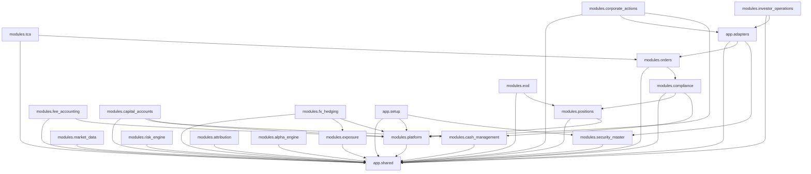
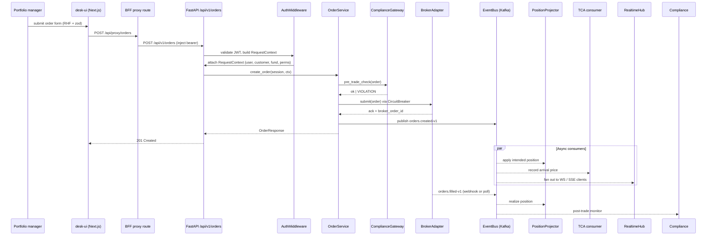

# Mini Hedge — Architecture

## 1. Overview

Mini Hedge is a **B2B2C SaaS** hedge-fund administration platform. A fund administrator (the B2B customer) operates the platform on behalf of multiple fund-manager clients (the second B) whose underlying investors (C) log in to a client-facing portal. The platform combines an order-management and risk system for the desk, a control-plane for ops, and a read-only investor portal — all backed by a single FastAPI core.

There are **three React/Next.js front-ends** and **one FastAPI backend**:

| Tier | App | Audience | Default port |
| --- | --- | --- | --- |
| `ui/` (a.k.a. **desk-ui**) | [ui/package.json](../ui/package.json) | Portfolio managers, analysts, risk & compliance | 3000 |
| `ops-ui/` | [ops-ui/package.json](../ops-ui/package.json) | Internal fund-admin staff / platform operators | 3100 |
| `client-ui/` | [client-ui/package.json](../client-ui/package.json) | Investors (read-only portal) | 3200 |
| `app/` (FastAPI) | [app/main.py](../app/main.py) | HTTP + SSE + Kafka consumers | 8000 |

Each UI is a Next.js App-Router app that talks to FastAPI through its own Next.js **BFF proxy** (`/api/proxy/*`) for auth-bearing requests, and to a Next.js SSE route (`/api/stream/*`) for real-time fanout.

---

## 2. Module topology

The Python backend is structured as **leaf-first modules** with a shared kernel. Dependencies are enforced by [tach](../tach.toml) with `exact = true`, which fails CI on any unapproved cross-module import.

### Rules encoded in [`tach.toml`](../tach.toml)

- `app.shared` depends on **nothing** (shared kernel — DB, events, auth primitives, observability).
- Every domain module depends on `app.shared`.
- A few modules depend on `app.modules.platform` (they need fund / customer / user metadata).
- `app.modules.orders` depends on `app.modules.compliance` (pre-trade gate).
- `app.modules.compliance` depends on `app.modules.positions` and `app.modules.cash_management` (for post-trade evaluations).
- `app.modules.tca` depends on `app.modules.orders`.
- `app.modules.eod` depends on `app.modules.positions` (EOD NAV calculation).
- `app.adapters` is a **hub** — depends on `shared`, `orders`, `security_master`. Concrete external clients live here ([app/adapters/](../app/adapters/)).
- `app.setup` is the DI composition root — wires all modules at boot ([app/setup.py](../app/setup.py)).

### Leaves (depend only on `app.shared`)

`security_master`, `market_data`, `exposure`, `risk_engine`, `cash_management`, `attribution`, `alpha_engine`, `regulatory`, `fund_structures`, `backtesting`, `quant_research`, `ai_analysis`, `alt_data`, `feature_store`.

### Hubs

- `app.shared` — every module imports from here.
- `app.modules.platform` — tenancy, users, customers, funds, audit ([app/modules/platform/](../app/modules/platform/)).
- `app.adapters` — external I/O (broker, fund-admin, KYC, LLM, market-data, reference-data).

### DAG

Each module is internally structured as `core/` (pure logic), `models/` (SQLAlchemy + Pydantic), `repositories/`, `services/`, `routes/`, `interfaces/` (Protocol typing), `dependencies.py` (FastAPI DI), `wiring.py` (module-level composition) — see [app/modules/orders/](../app/modules/orders/) as a canonical example.

---

## 3. Data flow patterns

The canonical write path is a **trade order**. From the desk-ui:

Key contracts along the path:

- **BFF proxy** — [ui/src/app/api/proxy/[...path]/route.ts](../ui/src/app/api/proxy/[...path]/route.ts) injects the NextAuth-managed access token.
- **Auth middleware** — [app/middleware/auth.py](../app/middleware/auth.py) decodes the JWT, resolves permissions via FGA, and pushes a `RequestContext` into an async contextvar.
- **Order service** — [app/modules/orders/services/order.py](../app/modules/orders/services/order.py).
- **Compliance gateway** — [app/modules/compliance/](../app/modules/compliance/) — inspects pre-trade limits against current positions + cash.
- **Broker adapter** — [app/adapters/mock_exchange_broker.py](../app/adapters/mock_exchange_broker.py) (wrapped in `CircuitBreaker`).
- **Avro event schemas** — [schemas/orders/created-v1.avsc](../schemas/orders/created-v1.avsc), [schemas/orders/filled-v1.avsc](../schemas/orders/filled-v1.avsc).

---

## 4. Tenant isolation

Customers are isolated logically (single shared DB today, customer-per-engine ready) and funds are isolated physically via **one PostgreSQL schema per fund**.

The mechanism is in [app/shared/database.py](../app/shared/database.py):

- The ORM models for positions declare a fixed placeholder schema `__table_args__ = {"schema": "positions"}`.
- `TenantSessionFactory` rewrites that placeholder to `fund_{slug}` per request using SQLAlchemy's `schema_translate_map` execution option.
- The active customer and active fund are held in two `ContextVar`s (`_customer_id_var`, `_fund_slug_var`) — one per `asyncio.Task`, which gives correct isolation under concurrent Kafka consumers.
- `EngineRouter` can map a customer to a dedicated engine (for future physical tenant split); today all customers share the default engine.

Request lifecycle:

1. `AuthMiddleware` extracts the customer + fund (from token claims or path / `X-Fund-Slug` header) and enters `sf.customer_scope(...)` and `sf.fund_scope(...)`.
2. Routes request a session via `Depends(get_db)` ([app/shared/database.py:225](../app/shared/database.py#L225)) — one pool checkout per request.
3. All reads and writes to the positions ORM models land in `fund_{slug}` automatically.
4. Shared schemas (`platform`, `security_master`, `market_data`) are unaffected.

Kafka consumers use the exact same `customer_scope` + `fund_scope` primitives before invoking repositories, so there is a single code path for HTTP and background work.

**Hard fence**: `require_permission` in [app/shared/auth/permissions.py](../app/shared/auth/permissions.py) compares the actor's effective customer to the request's customer and rejects mismatches with a 403 *before* any business logic runs.

---

## 5. Event bus

Events carry domain changes between modules. The bus is pluggable via the [`EventBus`](../app/shared/events.py) `Protocol`:

- **Tests & scripts** — `InProcessEventBus` in [app/shared/events.py](../app/shared/events.py) fans out to subscribers via `asyncio.gather(..., return_exceptions=True)`.
- **Production** — `KafkaEventBus` in [app/shared/kafka.py](../app/shared/kafka.py) uses `aiokafka` for native async I/O. Each subscribed topic gets a background consumer task.

Events are **Avro-encoded** using Confluent Schema Registry. The envelope lives in [schemas/envelope-v1.avsc](../schemas/envelope-v1.avsc) and each payload has its own `.avsc` file. Loading and registration is handled by [app/shared/schema_registry.py](../app/shared/schema_registry.py).

Topic naming (see `schema_registry.py`):

- `fund-{slug}.{domain}.{event}-v{n}` for fund-scoped events
- `customer-{id}.{domain}.{event}-v{n}` for customer-scoped events
- `shared.{domain}.{event}-v{n}` for cross-tenant reference data

Versioning is **explicit in the topic** (`-v1`, `-v2`). Schema evolution rules are enforced by Schema Registry's backward-compatibility checks. DLQs for poison messages live in [app/shared/dlq_manager.py](../app/shared/dlq_manager.py); operators can inspect them through `/api/v1/platform/dlq/*`.

Representative schemas: [schemas/orders/](../schemas/orders/), [schemas/trades/](../schemas/trades/), [schemas/compliance/](../schemas/compliance/), [schemas/positions/](../schemas/positions/), [schemas/eod/](../schemas/eod/), [schemas/risk/](../schemas/risk/).

---

## 6. Cross-cutting concerns

| Concern | Symbol | File |
| --- | --- | --- |
| JWT + FGA orchestration with caches | `AuthService` | [app/modules/platform/services/auth/orchestrator.py](../app/modules/platform/services/auth/orchestrator.py) |
| Per-request tenant + actor context | `RequestContext`, `AuthMiddleware` | [app/shared/auth/request_context.py](../app/shared/auth/request_context.py), [app/middleware/auth.py](../app/middleware/auth.py) |
| Append-only audit persistence (Postgres + CDC → Immudb + OpenSearch) | `AuditLogRepositoryProtocol` | [app/shared/audit/repository.py](../app/shared/audit/repository.py) |
| Audit bridge (listens to domain events → audit writes) | `AuditBridge` | [app/shared/audit/bridge.py](../app/shared/audit/bridge.py) |
| External-call resilience (CLOSED/OPEN/HALF_OPEN) | `CircuitBreaker`, `CircuitOpenError` | [app/shared/circuit_breaker.py](../app/shared/circuit_breaker.py) |
| Per-fund schema isolation | `TenantSessionFactory`, `EngineRouter` | [app/shared/database.py](../app/shared/database.py) |
| Idempotency keys on write routes | `IdempotencyMiddleware` | [app/middleware/idempotency.py](../app/middleware/idempotency.py) |
| Rate limits (per IP / per actor) | `slowapi` + `build_limiter` | [app/middleware/rate_limit.py](../app/middleware/rate_limit.py) |
| Request timeouts | `TimeoutMiddleware` | [app/middleware/timeout.py](../app/middleware/timeout.py) |
| Prometheus + OpenTelemetry | `PrometheusMiddleware`, `setup_telemetry` | [app/shared/observability/metrics.py](../app/shared/observability/metrics.py), [app/shared/observability/telemetry.py](../app/shared/observability/telemetry.py) |
| Structured logging (structlog) | `setup_logging` | [app/shared/observability/logging.py](../app/shared/observability/logging.py) |
| Feature flags | `FeatureFlags` | [app/shared/feature_flags.py](../app/shared/feature_flags.py) |
| Dev-secret loader | `load_vault_secrets` | [app/shared/vault.py](../app/shared/vault.py) |
| Token revocation (Redis) | `TokenRevocationService` | [app/shared/auth/token_revocation.py](../app/shared/auth/token_revocation.py) |

The DI composition root is [app/setup.py](../app/setup.py); each module contributes a `wiring.py` that `setup_all` calls during lifespan start-up.

---

## 7. Frontend architecture

All three UIs are Next.js 15 App Router apps sharing the same patterns and live together in a pnpm workspace ([pnpm-workspace.yaml](../pnpm-workspace.yaml)):

- **Feature folders** — `src/features/<domain>/{api.ts, components/, types.ts, hooks.ts}`. See [ui/src/features/orders/](../ui/src/features/orders/), [ui/src/features/risk/](../ui/src/features/risk/).
- **App router segments** — `src/app/(auth)/` and `src/app/(dashboard)/` route groups.
- **BFF proxy** — server-side route handler at [ui/src/app/api/proxy/[...path]/route.ts](../ui/src/app/api/proxy/[...path]/route.ts) forwards to FastAPI with the session's access token. Never exposes the token to the browser.
- **SSE route** — [ui/src/app/api/stream/route.ts](../ui/src/app/api/stream/route.ts) for realtime fanout (prices, positions, order updates).
- **Typed BFF client** — `openapi-fetch` typed with generated OpenAPI types in [packages/api-types](../packages/api-types). Entry point: [ui/src/shared/lib/api-client.ts](../ui/src/shared/lib/api-client.ts). Paths like `/api/v1/...` are auto-rewritten to `/api/proxy/...`.
- **Forms** — React Hook Form + zod. Form helpers in [ui/src/shared/lib/forms.ts](../ui/src/shared/lib/forms.ts).
- **Data fetching** — TanStack Query (`React Query`) with `prefetch.ts` in [ui/src/shared/lib/](../ui/src/shared/lib/) for server-component prefetch. SSE merges into the same query keys for push updates.
- **Auth** — NextAuth v5 with Keycloak provider; middleware-gated routes in [ui/src/middleware.ts](../ui/src/middleware.ts).
- **Shared design primitives** — [packages/ui](../packages/ui) (Tailwind + Radix-based primitives) consumed by all three apps.
- **Linting/formatting** — Biome (see `biome.json` in each app).

---

## 8. Testing strategy

| Layer | Location | Description |
| --- | --- | --- |
| **Unit** (~2700 tests across 237 files) | [tests/unit/](../tests/unit/) | Pure-logic tests per module using fakes, mirrors `app/modules/*` |
| **Integration** | [tests/integration/](../tests/integration/) | Full lifecycle with real Postgres + `InProcessEventBus` — trade lifecycle, multi-fund, event cascades, migrations ([test_trade_lifecycle.py](../tests/integration/test_trade_lifecycle.py), [test_multi_fund.py](../tests/integration/test_multi_fund.py), [test_event_cascade.py](../tests/integration/test_event_cascade.py)) |
| **Contract** | [tests/contract/](../tests/contract/) | OpenAPI contract test ([test_openapi_contract.py](../tests/contract/test_openapi_contract.py)) — guards the FastAPI spec that `packages/api-types` is generated from |
| **E2E** | [tests-e2e/](../tests-e2e/) | Playwright smoke specs per UI: [desk-ui.smoke.spec.ts](../tests-e2e/desk-ui.smoke.spec.ts), [ops-ui.smoke.spec.ts](../tests-e2e/ops-ui.smoke.spec.ts), [client-ui.smoke.spec.ts](../tests-e2e/client-ui.smoke.spec.ts). Shared auth setup in [auth.setup.ts](../tests-e2e/auth.setup.ts) uses the seeded `e2e-bot` user |
| **Unit (frontend)** | `ui/**/*.test.ts*` | Vitest alongside feature files; config in [ui/vitest.config.ts](../ui/vitest.config.ts) |
| **Load** | [load_tests/](../load_tests/) | Locust scenarios against API endpoints |

Fixtures: [tests/conftest.py](../tests/conftest.py), [tests/factories.py](../tests/factories.py), [tests/helpers.py](../tests/helpers.py).

---

## 9. Observability

The Four Golden Signals (latency, traffic, errors, saturation) are exposed by [`PrometheusMiddleware`](../app/shared/observability/metrics.py) and scraped at `/metrics`.

- **Metrics** — Prometheus config and alert rules live in [infrastructure/prometheus/](../infrastructure/prometheus/). Alerts include `HighErrorRate` (> 5% 5xx), `HighLatencyP99` (> 5s), `HighLatencyP95` (> 2s), `KafkaDLQEventsRising`, and circuit-breaker open alerts — see [alert_rules.yml](../infrastructure/prometheus/alert_rules.yml).
- **Logs** — Structured JSON via `structlog` with trace-ID injection ([logging.py](../app/shared/observability/logging.py)). Shipped to Loki via the Docker log driver; [infrastructure/loki/loki-config.yml](../infrastructure/loki/loki-config.yml).
- **Dashboards** — Grafana provisioning in [infrastructure/grafana/](../infrastructure/grafana/) with prebuilt dashboards for API health, Kafka throughput, tenant traffic, and order flow.
- **Tracing** — OpenTelemetry set up in [telemetry.py](../app/shared/observability/telemetry.py); `add_trace_id` processor binds `trace_id` into every log line.
- **Alertmanager** — [infrastructure/alertmanager/alertmanager.yml](../infrastructure/alertmanager/alertmanager.yml) routes severities to notification channels.

Business metrics (orders per minute, fill latency, DLQ depth, broker circuit state) are defined alongside the golden signals in [metrics.py](../app/shared/observability/metrics.py) and visible on the same dashboards.

---

## 10. Deployment

### Local development

`docker-compose` runs the full stack with profiles to pick a subset. See [docker-compose.yml](../docker-compose.yml).

- `core` profile — Postgres (+ replica), Redis, Kafka, Schema Registry, Keycloak, OpenFGA, OpenSearch, Immudb, Vault, Minio.
- The FastAPI app runs outside compose during dev (`make run`); alternative: `docker compose --profile app up`.
- Three UIs run via `pnpm dev` from the workspace root (`ui`, `ops-ui`, `client-ui`).

Bootstrap helpers:

- [Makefile](../Makefile) — common `make` targets (`seed`, `migrate`, `test`, `lint`).
- [scripts/](../scripts/) — init SQL, replica bootstrap, seed scripts.
- Keycloak realms imported automatically from [keycloak/*.json](../keycloak/).

### Production

Helm chart at [infrastructure/k8s/charts/mini-hedge/](../infrastructure/k8s/charts/mini-hedge/):

- `templates/backend/` — FastAPI deployment + HPA + service + serviceMonitor.
- `templates/ui/` — Three Next.js deployments (desk, ops, investor).
- `templates/migrations/` — Alembic migration Job that runs before backend rollout.
- `networkpolicy.yaml` — per-tier network policies.
- Values examples: [values-staging.yaml.example](../infrastructure/k8s/charts/mini-hedge/values-staging.yaml.example), [values-production.yaml.example](../infrastructure/k8s/charts/mini-hedge/values-production.yaml.example).

Infra dependencies (Postgres, Kafka, Keycloak, OpenFGA, Redis, Loki, Prometheus, Grafana, Vault, Immudb, OpenSearch, Minio) are installed as sub-charts or external managed services — see chart notes in [infrastructure/k8s/README.md](../infrastructure/k8s/README.md).

### Migrations

Alembic is configured with an async plugin that rewrites the schema during `alembic upgrade` — see [app/shared/alembic_plugins.py](../app/shared/alembic_plugins.py) and [alembic.ini](../alembic.ini). Each module owns a migrations directory (e.g., [app/modules/orders/migrations/](../app/modules/orders/migrations/)). Fund-schema creation is orchestrated centrally by the platform module on fund provisioning.
